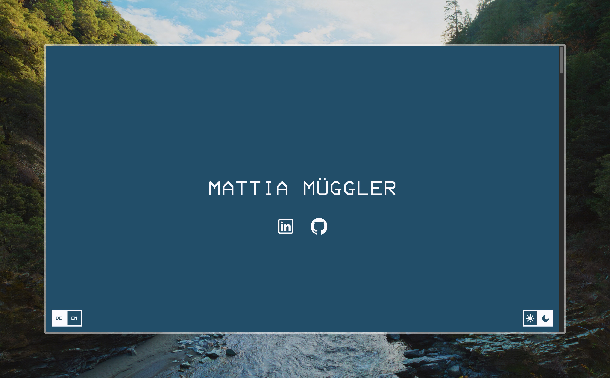

# 👋 Hi!

Hi, my name is Mattia. I’m a software engineer based next to St. Gallen, Switzerland. My passion is technology, especially coding, and learning new things about it. In my spare time I’m working on several projects, some of which are open source and can be visited in my GitHub. Check out my website for more information about me.

# My Sites

<table align="center" style="border-collapse: collapse;">
  <tr>
    <td></td>
    <td></td>

  </tr>
  <tr>
    <td><a href="https://mattiamueggler.ch">mattiamueggler.ch</a></td>
    <td><a href="https://cv.mattiamueggler.ch">cv.mattiamueggler.ch</a></td>
  </tr>
</table>

# My Repositories

# 📊 My Stats

  

  

  
Show more detailed statistics

    
  

# Footer

Credits

  
[Julian Prieber for the inspiration for this README](https://github.com/JulianPrieber)

